計算事例
================
ここでは直線水路における障害物を含む流れの計算例を示す。

iRICの起動とソルバーの選択
--------------------------

iRICのオープニング画面で、[新しいプロジェクト]を選択(:numref:`01_start` )
   
.. _01_start:

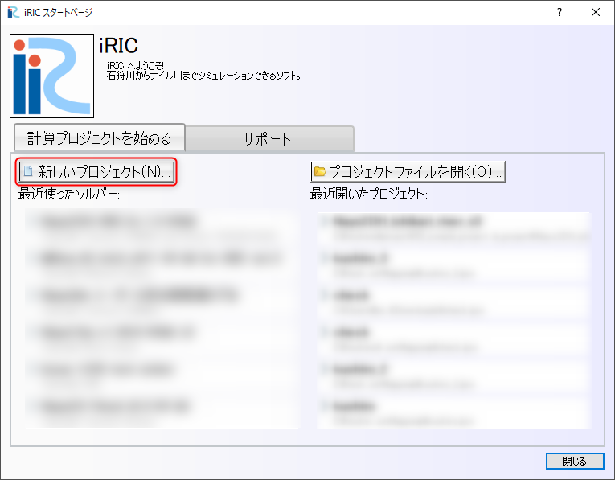

   : 新しいプロジェクト

:numref:`02_select` ソルバーの選択Windowで[NaysMini(Pythonで書かれたNays2dHの簡易版)]を選択し、
[OK]OKを押す。

.. _02_select:

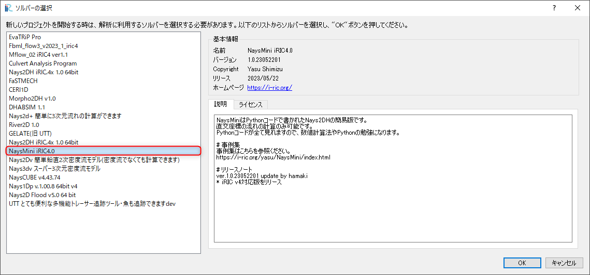

   : ソルバーの選択

計算格子の作成
-------------------

メインメニューから[格子]→[格子生成アルゴリズムの選択]を選ぶ 

.. _koshi_1:

   : 格子生成(1)

[格子生成アルゴリズムの選択]ウィンドウで[簡易直線・蛇行水路生成ツール]を選び[OK]を押す。

.. _koshi_2:

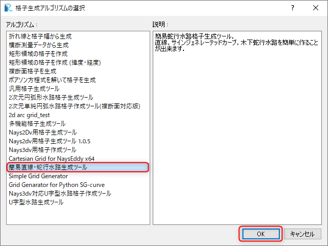

   : 格子生成(2)

[格子生成]ウィンドウの[水路形状]タブでパラメータを :numref:`koshi_3` のように設定し、[格子生成]を押す。

.. _koshi_3:

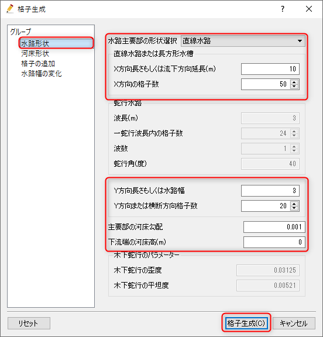

   : 格子生成(3)

例によってしつこく「マッピングしますか？」と聞かれるので、[はい]を押す。

.. _koshi_4:

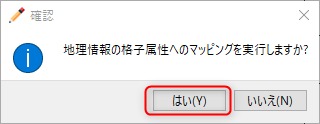

   : 格子生成(4)

:numref:`koshi_5` のような格子が作成される。

  .. _koshi_5:

   : 格子生成完了

障害物セルの指定
-----------------

ここでは流路の中央上流側に長方形の障害物を設置する。
:numref:`obst_1` に示すように, オブジェクトブラウザーの[セルの属性]および[障害物セル]に☑マークを入れ、
:numref:`obst_2` に示すように障害物にしていしたいセルをマウスで囲い、
右クリックして現れる[障害物セルの編集]ウィンドウで、[障害物セル]に指定し[OK]を押す。

.. _obst_1:

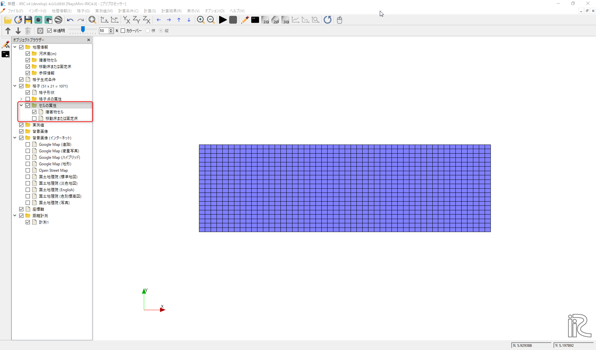

   :障害物の設定(1)

.. _obst_2:

   :障害物の設定(2)

.. _obst_3:

   :障害物の設定(完了)

計算条件の設定
----------------

メインメニューから[計算条件]→[設定]を選択。(:numref:`joken_1` )

.. _joken_1:

.. figure:: images/03/joken_1.png
   :width: 90%

   :計算条件の設定(1)

[計算条件]ウィンドウで、[水理条件および物理定数]を :numref:`joken_2` のように設定する。

.. _joken_2:

.. figure:: images/03/joken_2.png
   :width: 65%

   :計算条件の設定(2)

[計算条件]ウィンドウで、[境界条件]を :numref:`joken_3` のように設定する。

.. _joken_3:

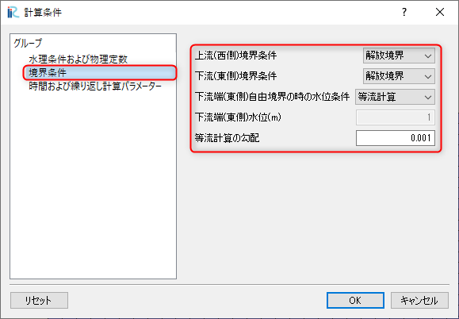

   :計算条件の設定(3)

[計算条件]ウィンドウで、[時間および繰り返し計算パラメーター]]を 
:numref:`joken_4` のように設定し、[保存して閉じる]をクリック。

.. _joken_4:

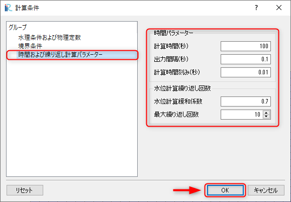

   :計算条件の設定(4)

計算の実行
-----------   

メインメニューから[計算]→[実行]を選択。

.. _jikko_1:

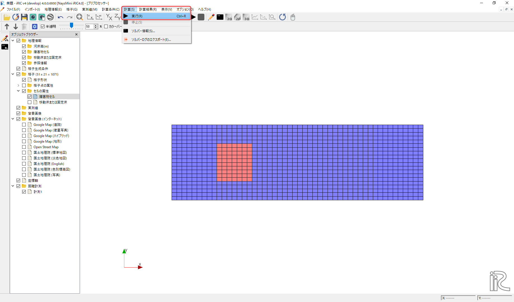

   :計算の実行(1)

プロジェクトを保存するか聞かれるので通常は[はい]を選択して、プロジェクトを保存する。

.. _jikko_2:

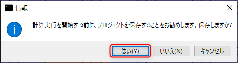

   :計算の実行(2)

:numref:`jikko_3` のコンソールウィンドウが出て計算が実行される。

.. _jikko_3:

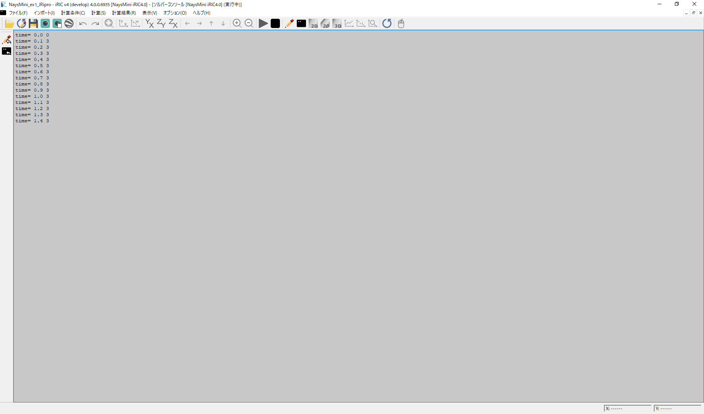

   :計算の実行(3)

計算が終了すると「ソルバーの計算が終了しました」と表示されるので、[OK]を押す。

.. _jikko_4:

   :計算の実行(4)

計算結果の表示
---------------

メインメニューから[計算結果]→[新しい可視化ウィンドウ(2D)を開く] を選択する。

.. _kekka_1:

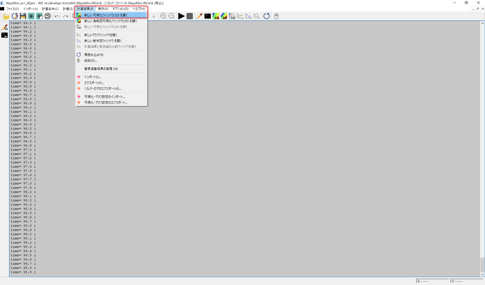

   :計算結果の表示(1)

[可視化ウィンドウ(2D)]が表示される。

.. _kekka_2:

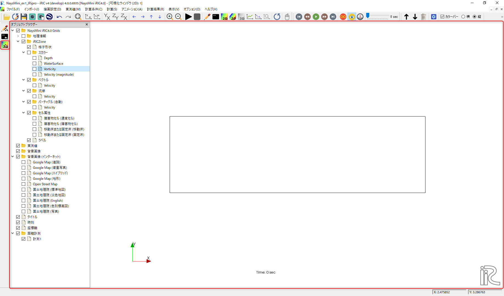

   :計算結果の表示(2)

[オブジェクトブラウザー]で[セル属性]と[障害物セル(障害物セル)]に☑マークを入れると、
障害物の部分が :numref:`kekka_3` のように色が変わる。 

.. _kekka_3:

   :計算結果の表示(3)

[オブジェクトブラウザー]で[スカラー(格子点)]と[Vorticity]に☑マークを入れて、[Vorticity]を右クリックして、
[プロパティ]を選択する( :numref:`kekka_4` )。なお。[Vorticity]は `渦度 <https://kotobank.jp/word/%E6%B8%A6%E5%BA%A6-34621>`_ 
のことで、次式で求められる水平渦の強度である。

.. math::
   \Omega = \frac{\partial u}{\partial y}-\frac{\partial v}{\partial x}

.. _kekka_4:

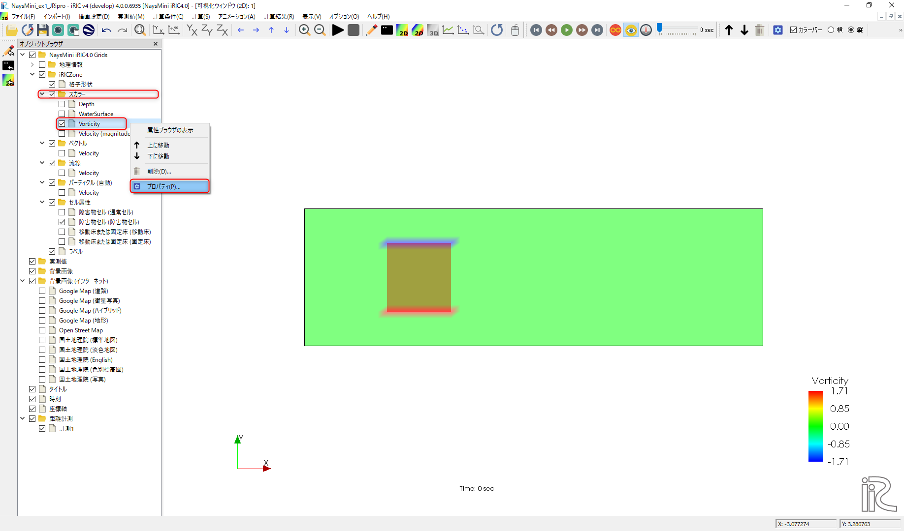

   :計算結果の表示(4)

[スカラー設定]ウィンドウで、[物理量:], [値の範囲]の[自動]の前にある☑マークを外し、
[最大値]および[最小値]をそれぞれ[2]と[-2]に設定する( :numref:`kekka_5` ).

.. _kekka_5:

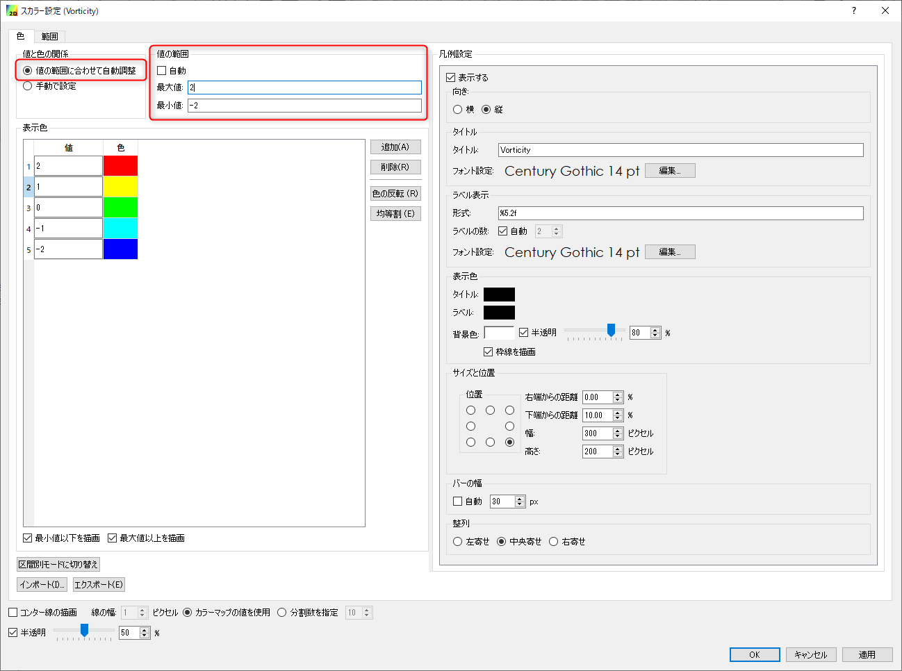

   :計算結果の表示(5)

同じ[スカラー設定]ウィンドウで、[カラーマップ]の[手動]ボタンを押して[設定]をクリックして
現れる[カスタムカラー]ウィンドウで[種類]を[3色]にして、[最大値を]赤に、最小値を[青]
にして[OK]を押す。

.. _kekka_6:

   :計算結果の表示(6)

[スカラー設定]ウィンドウに戻って、[半透明]の前の☑ボックスからチェックをはずして、[OK]を押す。

.. _kekka_7:

   :計算結果の表示(7)

オブジェクトブラウザーの[スカラー]の[Vorticity]をクリックし、
カラーマップをドラッグして適当な位置に移動する。さらに、オブジェクトブラウザーで、
[時刻]を右クリックして[プロパティ]を表示し。[フォント]のサイズを適当に大きくする。

.. _kekka_9:

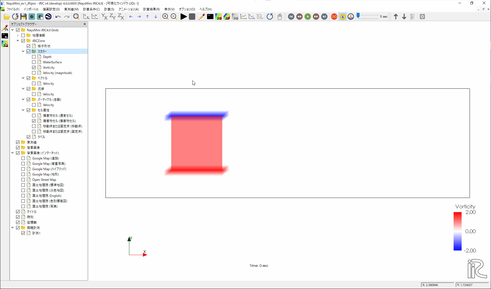

   :計算結果の表示(9)

メインメニューから[アニメーション]→[実行]を選択すると、渦度とパーティクルの動画が始まる。

.. _kekka_10:

.. figure:: images/03/kekka_10.gif
   :width: 90%

   :計算結果の表示(10)

同様に、下記 :numref:`kekka_11` の手順で、流速ベクトル、流速コンターのアニメーションを
表示できる。

.. _kekka_11:

.. figure:: images/03/kekka_11.gif
   :width: 90%

   :計算結果の表示(11)

アニメーションファイルの作成
----------------------------

メインメニューから[ファイル]→[連続スナップショット/動画/Google Earth出力]を選択

.. _anime_1:

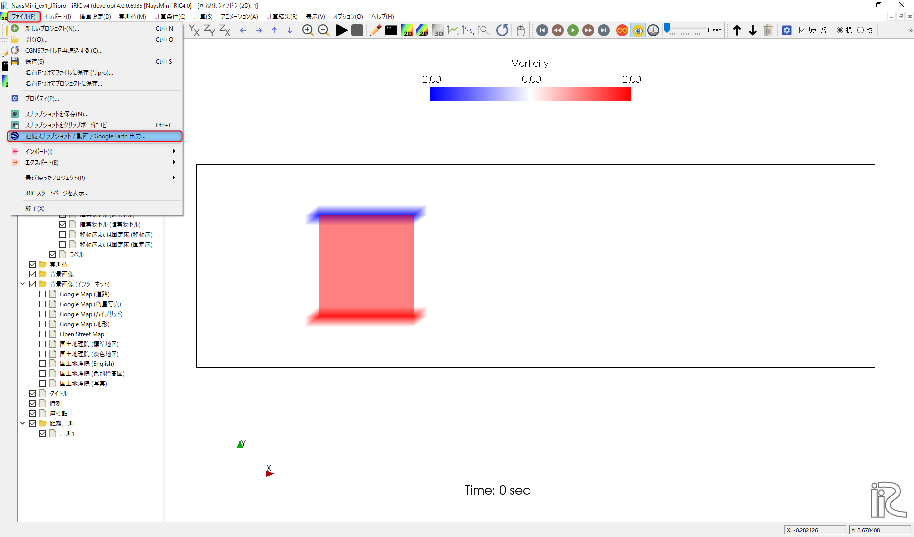

   :アニメーションのファイルの作成(1)

[イントロダクション]が表示されるので[次へ]を押す。

.. _anime_2:

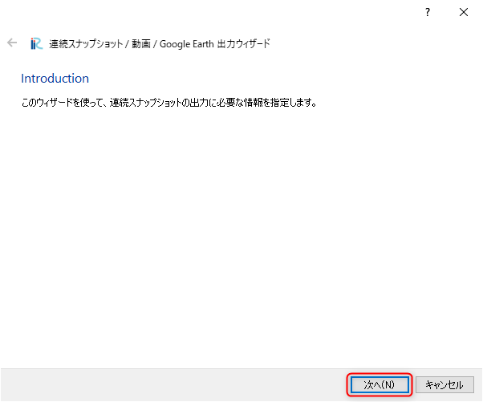

   :アニメーションのファイルの作成(2)

[ウィンドウの選択]が表示されるので、アニメーションにしたいウィンドウを選んで[次へ]を押す・

.. _anime_3:

   :アニメーションのファイルの作成(3)

[ファイル属性]ウィンドウが表示されるので、ファイルを保存するフォルダ、静止画像の形式、連番の桁数など指定して
[次へ]を押す。

.. _anime_4:

   :アニメーションのファイルの作成(4)

[動画ファイルの設定]ウィンドウで、[動画ファイルを出力する]に☑マークを入れる。
動画は[動画の長さ]もしくは[1秒あたりのフレーム数]を指定できるが、
ここでは[動画の長さ]を[10秒]に指定し、[次へ]を押す。

.. _anime_5:

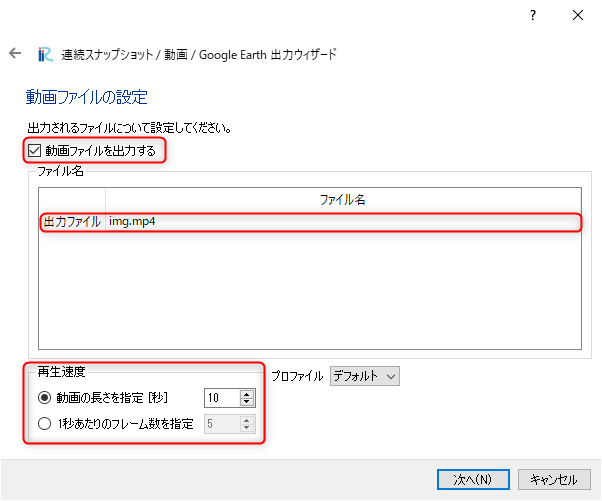

   :アニメーションのファイルの作成(5)

[タイムステップ設定]では開始時間、終了時間、間引きなどの指定が出来るので、適宜指定して[次へ]を
押す。

.. _anime_6:

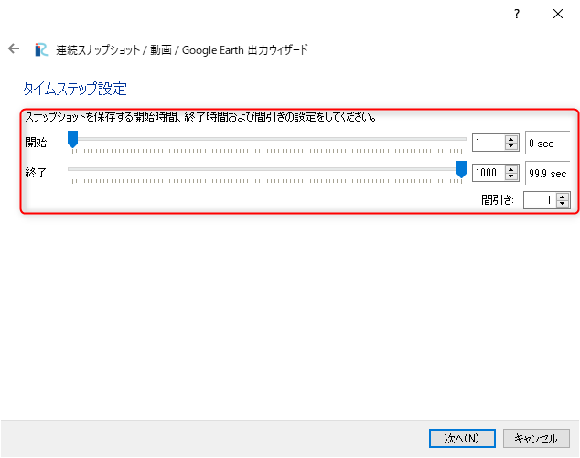

   :アニメーションのファイルの作成(6)

iRICでは、アニメーションをGoogle Earthに出力することが出来る。必要であれば
[Google Earthに出力する]に☑マークを入れる。不要であれば☐マークは入れないで、
[次へ]を押す。

.. _anime_7:

   :アニメーションのファイルの作成(7)

最後に生成されるフィルの一覧が表示されるので、確認して良ければ[完了]を押す。

.. _anime_8:

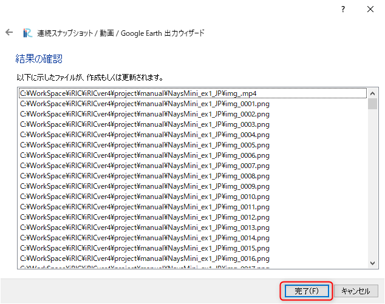

   :アニメーションのファイルの作成(8)

保存の進行状況がパーセント表示で示され、終了すると、
指定したフォルダに連番のイメージファイルと動画ファイル(mp4)形式が生成される。

.. _anime_9:

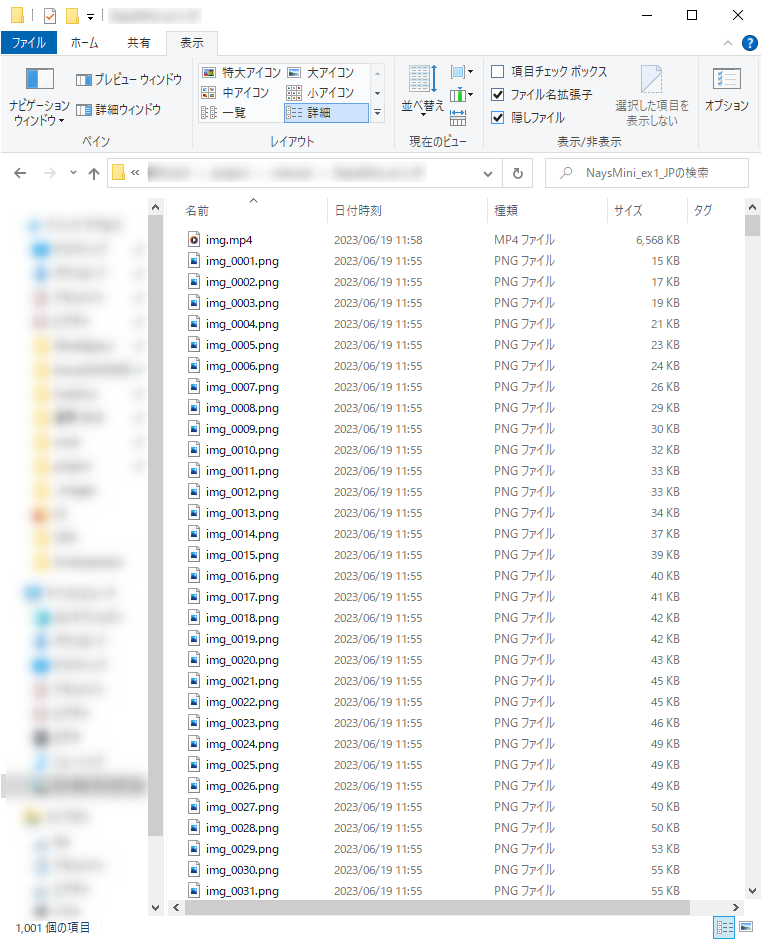

   :アニメーションのファイルの作成(9)

動画をmp4以外の形式に変換したい場合は `ffmpeg <https://ja.wikipedia.org/wiki/FFmpeg>`_ など
が便利である。例えば、mp4からgifアニメに変換する場合はコンソール画面で::

   ffmpeg -i img.mp4 -vf scale=640:-1 -r 30 -loop 0 img.gif

打ち込めば下記のアニメーションgifが生成される。

.. _anime_10:

.. figure:: images/03/anime_10.gif
   :width: 90%

   :アニメーションファイル